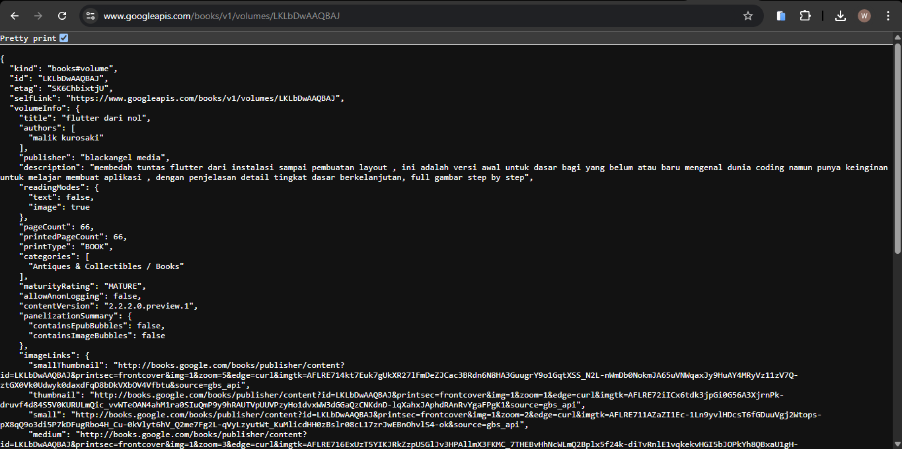

# books

A new Flutter project.

## Praktikum 1
### Soal 2
    

### Soal 3
    

    ```dart
    onPressed: () {
                setState(() {});
                getData()
                    .then((value) {
                      result = value.body.toString().substring(0, 450);
                      setState(() {});
                    })
                    .catchError((_) {
                      result = 'An Error Occurred';
                      setState(() {});
                    });
              },
    ```
    1. Penggunaan substring(0, 450)
    substring(0, 450): Mengambil 450 karakter pertama dari hasil response.
    Berguna jika response terlalu panjang, sehingga hanya sebagian kecil ditampilkan.

    2. catchError(_) / Menangani Kesalahan (Error Handling)
    Jika getData() gagal (misalnya koneksi terputus atau server error), fungsi catchError() akan menangkap error tersebut.
    Error ditangani dengan menampilkan pesan "An Error Occurred" agar pengguna tahu ada masalah. 
    setState(() {}); dipanggil agar UI diperbarui dengan pesan error.